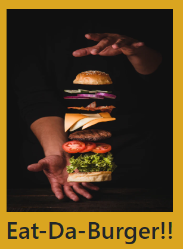

# Eat-Da-Burger!

  ## Description
  This is a burger logger with MySQL, Node, Express, Handlebars and a homemade ORM

  
  
  ## Image and Video

  

  

  ## Table of Contents
  * [Installation](#installation)
  * [Usage](#usage)
  * [License](#license)
  * [Contributing](#contributing)
  * [Questions](#questions) 

  ## Installation
  Open project in heroku. Click Devour it to enjoy a burger.  Once devoured, the burger will show in devoured column.  You can add your own burger creation through input field to be devoured.

  ## Usage
  * Eat-Da-Burger! is a restaurant app that lets users input the names of burgers they'd like to eat.

  ## License
  © 2020 Kate Meersman brand. All Rights Reserved. 

  

  ## Contributing
  Kate Meersman

  ## Questions
  * katie4682@yahoo.com